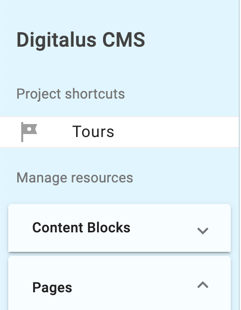

# Extending Digitalus CMS

## Shortcuts



Shortcuts are links which are added to the top of the Digitalus UI. This is the easiest way
to add custom functionality to your CMS.

```typescript
constructor(private dig: DigCmsService) {
  dig.addShortcut({
    title: 'Tours',
    path: '/tours',
    // optional description, displays a tooltip
    description: 'Manage tours and trips',
    // optional icon, see https://fonts.google.com/icons
    icon: 'tour',
  })
}
```
